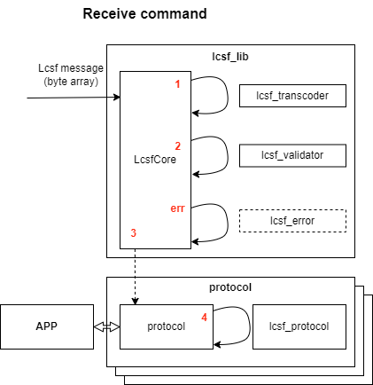
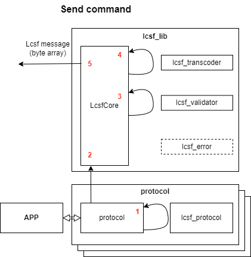

## Presentation

LCSF Stack Rust is a Rust implementation of the LCSF (Light Command Set Format).

This adds a software layer to easily encode/decode custom command sets protocols based on LCSF to your project.

## About LCSF

LCSF is a specification to easily create and deploy custom command sets.

For more information on the project, check the official LCSF documentation [here](https://jean-roland.github.io/LCSF_Doc/).

## How to use

*WIP* Install as source code or crate

Then, to interface with your project:
* Create a custom protocol either by hand or by using the [LCSF Generator](https://github.com/jean-roland/LCSF_Generator) (recommended).
* Instantiate a `LcsfCore` object with the desired parameters, example of how to use this object can be found in this repo's `main.rs`.

## Stack breakdown

The `lcsf_lib` itself is composed of 4 files:
* `lcsf_transcoder`: Serialize/Deserialize `LcsfRawMsg` objects to and from `byte array`.
* `lcsf_validator`: Validate/Encode `LcsfRawMsg` into `LcsfValidCmd` following a protocol descriptor object `LcsfProtDesc`.
* `lcsf_error`: Handle the processing/creation of the built-in LCSF Error Protocol. For more information on the error protocol, check the LCSF documentation.
* `lcsf_core`: The core file that links all the other parts together into a simple to use `LcsfCore` object.

If you use LCSF Generator, you will get two more files per protocol:
* `lcsf_protocol_<name>`: An lcsf abstraction layer that will convert an `LcsfValidCmd` into a protocol specific, easier to use, `CmdPayload`. Also contains your protocol's `LcsfProtDesc`.
* `protocol_<name>`: A skeleton of application file to process the received commands you need to fill. Contains an `init_core` function to give an `LcsfCore` the protocol's details.

`LcsfCore` is the main object that is used to process lcsf messages. It has 5 methods:
* `new`: Create an `LcsfCore` object.
* `update_err_cb`: Change the function called when an lcsf error protocol message is received.
* `add_protocol`: Add your custom protocol `LcsfProtDesc`, allowing the core to process messages from this protocol.
* `receive_buff`: Process an incoming lcsf message as a byte array.
* `send_cmd`: Process an outgoing command.

## Init

When instantiating your `LcsfCore` object with `new()` you have to feed three parameters:
* `mode: LcsfModeEnum`, indicates the lcsf representation to use, either Small or Normal. For more information on lcsf representation, check the LCSF documentation.
* `send_cb: fn pointer`, a function pointer to receive the encoded lcsf frame and send them wherever they're needed.
* `do_gen_err: bool`, indicates if the module will generate an lcsf error protocol message when decoding an incoming message fails.

At creation, your `LcsfCore` can only handle the default lcsf error protocol. You need to give it the `LcsfProtDesc` and corresponding callback with the `add_protocol()` method. This is easily done by calling your protocol's `init_core` function.

## Send/Receive messages

Once your `LcsfCore` is init, here's how receiving and sending commands work in a nutshell:

When receiving an lcsf message as an array of bytes from whatever network link you're using, the application shall send it to an `LcsfCore` object that will do the processing:
* 1) The buffer is deserialized into an `LcsfRawMsg` by the `lcsf_transcoder module`
* 2) The `LcsfRawMsg` is validated into an `LcsfValidCmd` by the `lcsf_validator` module, using the available `LcsfProtDesc`
* 3) The `LcsfValidCmd` is passed along to the corresponding protocol callback
* 4) The protocol callback asks its specific `lcsf_protocol` module to turn the `LcsfValidCmd` into a specific `CmdPayload` than can be easily used by your application
* err) The `lcsf_error` module is called if an error occurred during transcoding and validation or if the packet itself is an `lcsf error protocol` message

When sending a protocol specific `CmdPayload`, your application should use the `protocol` module to do the processing:
* 1) The `CmdPayload` will be turned into a `LcsfValidCmd` by the `lcsf_protocol` module
* 2) The `LcsfValidCmd` is sent to the `LcsfCore`
* 3) The `LcsfValidCmd` is turned into a `LcsfRawMsg` by the `lcsf_validator` module, using the corresponding `LcsfProtDesc`
* 4) The `LcsfRawMsg` is serialized into a byte array by the `lcsf_transcoder module`
* 5) The lcsf message is sent to the send callback for processing

## Note on recursivity

Since LCSF is based on nested structures, the stack use recursive functions.

Recursivity can be frowned upon, which is why the stack is made to limit the issue:
* The number of calls is directly linked to the number of sub-attribute layers in a protocol, that means the user has direct control.
* The stack is linear in its recursivity (one call will only lead to a maximum of one other call).

## Build, tests & docs

If you want to run the project as is use `cargo run`

To run the test suite use `cargo test`

To generate the doc use `cargo doc --no-deps`, you can access the documentation at `target/doc/help.html`.

## Resource usage

*WIP* do some benchmarking
